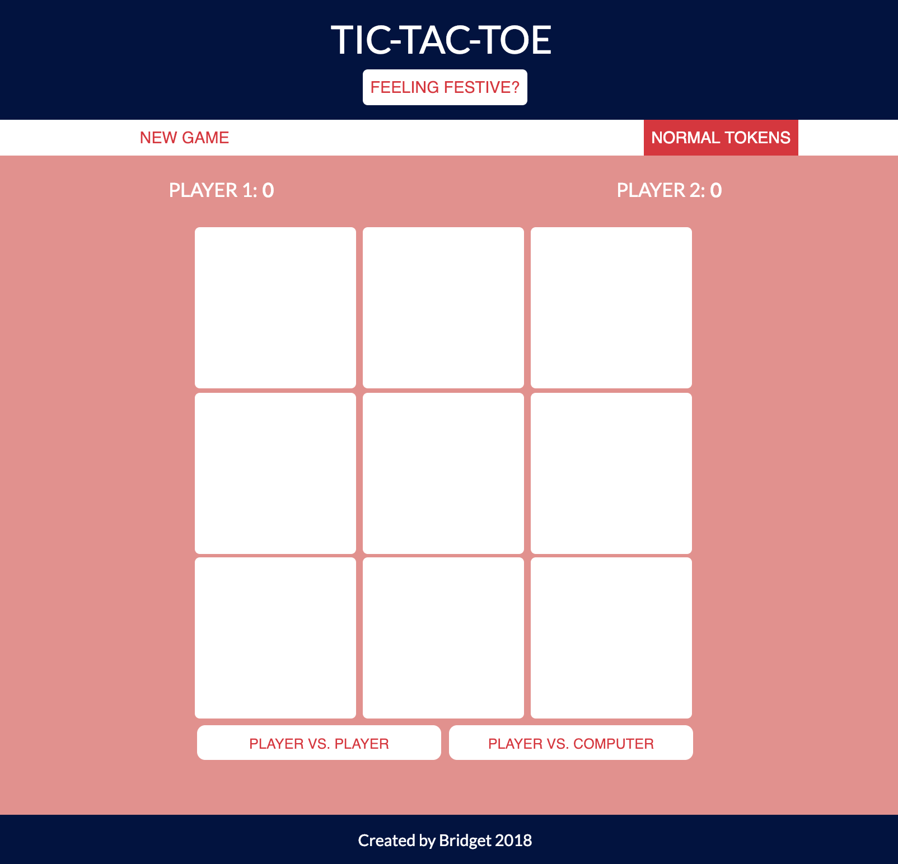
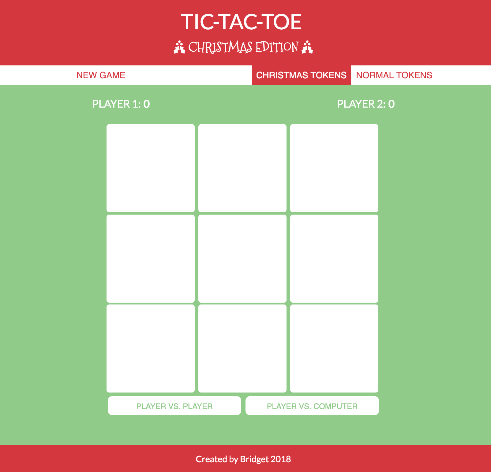

# Project 0 - Tic Tac Toe

## Why does this project exist
This game is a project for the immersive web development course at General Assembly. The goal is to take what we've learned about HTML, CSS, Javascript & jQuery in the last two weeks and create a Tic Tac Toe game from scratch.

At the time of developing this game/writing this README, it is 1 week until Christmas, so it is festively themed - 'tis the season etc. I may remove this later, but Christmas is fun so I also might leave it.

## How I did this
I started by creating a game object containing all the necessary logic to play Tic Tac Toe using noughts & crosses. It was initially a very basic player v player version. I spent a while mapping out how the functions would work and I wrote a fair bit of code to get it functioning. After that the challenge was to refactor the functions to make them less repetitive. The checkWinner function was particularly long and repetitive and it took over half a day for me to work out a better way of doing it.

Once I was happy with the functionality I tackled a bit of CSS and added some animations to make it play smoothly, followed by creating a computer AI. Adding the computer into the logic was a frustrating process because I had to rewrite a bit of the existing code and make it mesh with what I already had. It now works reasonably well (but I'm sure it still has a few bugs).

Languages & Tools:
- HTML
- CSS
- JavaScript
- jQuery
- [Font Awesome](https://fontawesome.com/icons)
- [Google Fonts](https://fonts.google.com/)

## Features
- Win counter and new game button so you can play multiple games and keep track of scores
- Optional Christmas tokens and Christmas theme
- An easy AI to play against

## Live Demo
[Click here](https://bridgetmcmahon.github.io/project0/) to play the game.

### How to play
Tic Tac Toe, also known as Noughts & Crosses, is a two player game where each player is assigned a token (usually X and O) and take turns placing their token on a 3 x 3 board. The objective is to get three of your tokens in a horizontal, vertical or diagonal row on the board.

## Still to come
I attempted creating a computer AI that was reasonably hard (if not impossible) to beat. I tried implementing this using the min-max algorithm after reading a [Wikipedia](https://en.wikipedia.org/wiki/Tic-tac-toe) article which boldly claims that "it is straightforward to write a computer program to pay tic-tac-toe perfectly". As someone new to coding, it is apparently not so straightforward. [This article](https://medium.freecodecamp.org/how-to-make-your-tic-tac-toe-game-unbeatable-by-using-the-minimax-algorithm-9d690bad4b37) at Free Code Camp does a good job of explaining the concept and how to implement the algorithm in the game, but sadly both my maths and coding skills fell short and I couldn't quite get it to work. Instead, the computer AI is simple and fills random positions on the board.

The unbeatable AI is something I plan to keep working on and eventually solve.

## What it looks like

#### The festive version:

